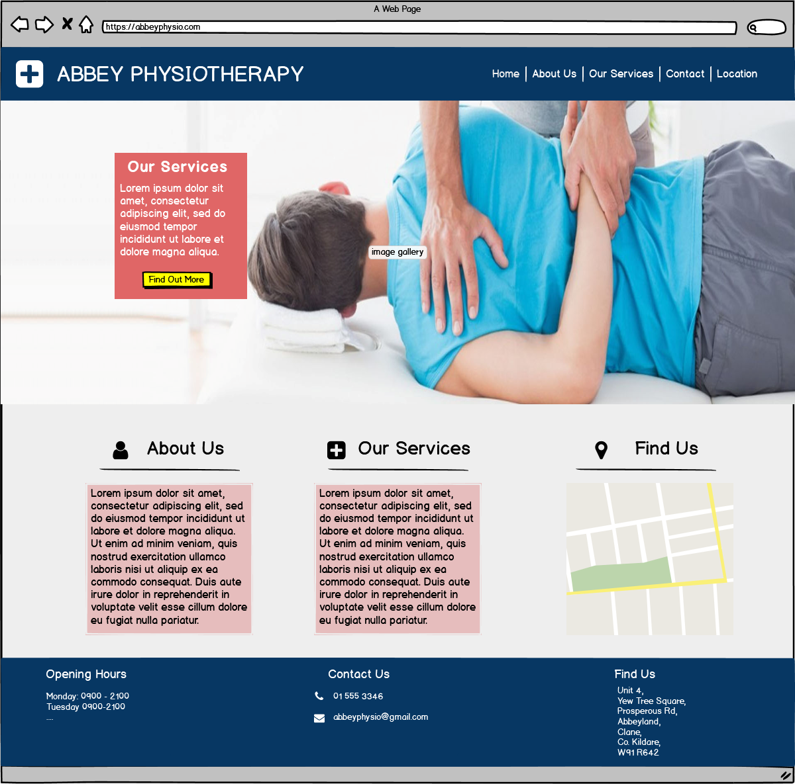

# Abbey physiotherapy

### Code Institute - Milestone Project One: User Centric Frontend Development

For my project I decided to build a template website for my brother's business, a private physiotherapy clinic. He currently has just a landing page and wants to increase the business's online presence. At the moment he relies on word of mouth and often has feedback from patients they couldn't find him online. 

The live website can be accessed [here](https://allanahmurphy.github.io/AbbeyPhysio_MS1/)
 
## UX

#### Project Objective
The business goal of the website was provide an increased presence online, similar or better than those of competitors, providing information to patients and potentially attract new patients. 
 
#### User Stories
I created a number of user stories to help inform the requirements of the website, as detailed below. 

* As the business owner, I want to promote my business online so that I can attract new customers.
* As a user, I want to read about what treatments are available so I can decide if it's the correct treatment for my injury.
* As a user, I want to contact number for the clinic so that I can arrange an appointment.
* As a user, I want to send a query to the clinic to find out more information.
* As a user, I want more information on the location so I can easily find the clinic when visiting.
* As a user, I want to find out where the clinic is so I can plan where to park when visiting.
* As a user, I want to know about the physio's experience so I can decide if they are the right physio for me.
* As a user, I want to information on the classes offered so I can see if the time suit me.

#### Design Choices

I wanted the website to look professional and appropriate for type of business, i.e. clinical practice. I read about [colour psychology](https://neilpatel.com/blog/psychology-of-color-and-conversions/) and the preferences of different users for different types of websites. Based on this I decided on a blue/white colour scheme with accent colours for calls to action/emphasis. I choose blue as its perceived as safe, dependable and trustworthy colour and is preferred by both men and women. The palette of colours used on the website including accent colours is outlined below. 

In terms of the overall design, I wanted the website to feel modern but not overally stylised or minimalist. One of the main cohorts of the business's client base is older people so I wanted something easily accessible and readable with obvious calls to action (i.e contact or email business). The initial wireframe for the home page is shown below and while the design evolved during detailed design I think it still gives a strong sense of the final website. 

All wireframes created for the project can be found [here](https://github.com/allanahmurphy/AbbeyPhysio_MS1/wireframes). The wireframes were created using [Balsamiq](https://balsamiq.com/).  

## Features

### Existing Features

#### Header, Navbar and Footer

Every page shares the same header, navbar and footer with the active tab changed to reflect the current page. Below outlines the features included in the header and navbar.

- Company logo and name link back to home page;
- Two call to action 'buttons' linking to contact and booking form (only visible on larger devices as clutter smaller devices);
- Active page highlighted in navbar;
- dropdown menu for subsection of services page;
- Accent colour on hovering over nav items;
- Collapsed hamburger navbar on smaller devices. 

Within the footer the following us included.

- Opening hours;
- Contact details with links to the contact page;
- 'Find us' info with address and google map linking to the Find Us webpage. 

#### index.html

Within the home page the following features are included (as well as the above):

- Hero image;
- Callout with important information related to recent reopening;
- 'Call Us' button which tiggers a modal call out with phone number;
- Three subsections providing brief overview of the 3 of the other pages with links to read more;

#### about.html

- Brief history of the clinic history with link to services page;
- Bio of the head phyio with circular stylised image;
- Bio of personal trainer with image;

#### services.html

- Overview of physio treatments offered for a range of conditions;
- Conditions presented in a collapsable text boxes as not to overwhelm page with unneccessary text;
- Overview of personal training and yoga services with appropriate images.

#### contact.html

- form to send query with required fields;
- modal popup when submitted to with 'message sent alert;
- form for booking app with date picker and time choices and another popup after submitting;

#### location.html

- directions to clinic;
- coloured card with address (only visible on larger devices to simply UX on mobile);
- interactive google maps api with marker on clinic location. 

### Future Features

- 'Call us' button on home page hero image should link to actual call function on mobile devices;
-  Forms should connect to email;
-  Booking form is currently for show only with unconstrainted dates and random times shown this could be connected to an online booking system in the future.

## Technologies Used

### Languages Used

* [HTML5](https://en.wikipedia.org/wiki/HTML5)
* [CSS3](https://en.wikipedia.org/wiki/Cascading_Style_Sheets)

A small about of [JavaScript](https://www.javascript.com/) was used to implement Google Maps Api on location page. This was copied from Google developer tools [tutorial](https://developers.google.com/maps/documentation/javascript/adding-a-google-map).

### Frameworks, Libraries and Programs Used

- [Bootstrap v4.5.0](https://getbootstrap.com/) - Used for the responsove layout as well as custom components such as forms, modal popups, navigation bar, footer, cards and collapsable element.
- [jquery](https://jquery.com/) - Used in some of the clickable elements such as collapsable 'hamburger' nav bar.
- [popper.js](https://popper.js.org/) - Used in some of the clickable elements such as collapsable 'hamburger' nav bar.
- [Font Awesome](https://fontawesome.com/) - Font Awesome was used to add social icons throughout the site and improve overall design and legibility;
- [Google Fonts](https://fonts.google.com/) - Google Fonts was used to import 'Roboto' and 'Exo' fonts in the style.css stylesheet.
- [Git](https://git-scm.com/) - Git was used to allow for tracking of any changes in the code and for the version control.
- [GitPod](https://www.gitpod.io/) - GitPod, conected to GitHub, hosted the coding space and allowed the projected to be commited to the Github repository.
- [Github](https://github.com/) - GitHub is used to host the repository and publish the live website by using Git Pages.
- [Google Chrome developer tools](https://developers.google.com/web/tools/chrome-devtools) for testing and troubleshooting.
- [W3C Markup Validation](https://validator.w3.org/) used to validate HTML.
- [W3C CSS validation](https://jigsaw.w3.org/css-validator/) used to validate CSS.

## Testing

#### Code Validation

Each page was through the W3C HTML and the stylesheet through the CSS validator. The following errors were flagged at corrected:

- Originally had anchors within buttons in the header which produced and error change to style anchors to look like buttons instead;
- Placeholder for form type date;
- Incorrect charachter escape on whitespace, removed this whitespace and created gaps with margins instead;
- arialabelledby related to no ID, changed this to arialabel to solve.

There was additional warning in relation to the date which flagged the date type would not be recognised on all browsers types. I have left this for now as it required use of code I didn't yet understand. There were no errors or warning flagged in the CSS validator. 

#### Browser Compatibility

The live website, hosted on gitpages, has been opened and tested on multiple browsers for responsives and intended appearance. Browers tested included:

* Google Chrome
* Opera
* Safari
* Microsoft Edge
* Internet Explorer
* Firefox

### Language Validation

Each seperate page of the website was ran through [W3C Markup Validation](https://validator.w3.org/) & [W3C CSS validation](https://jigsaw.w3.org/css-validator/) to find any errors. One error in relation to the use of a ref within a button was flagged. This was removed and placed in a div styled as a button instead. 

### Responsiveness

The website has been tested across multiple screen sizes using [Google Chrome developer tools](https://developers.google.com/web/tools/chrome-devtools) for a range of screen sizes including:

- iphone 5/SE,6,7,8, X and 6,7,8 plus for portrait and landscape.
- Moto G4 and Samsung Galaxy S5
- ipad and ipad pro
- varying laptop sizes and screen sizes using responsiveness tool on developer tools. 

The website was also opened and checked on Huaweu P10 and Samsung A20 mobile devices. 

### User experience & Usability

I also asked multiple users of different ages (family members) to open the devices on mobiles and laptop to sense check the layout, readability and usability of the site. 

### Performance Testing

## Deployment

## Credits

### Content

### Media

### Acknowledgements

